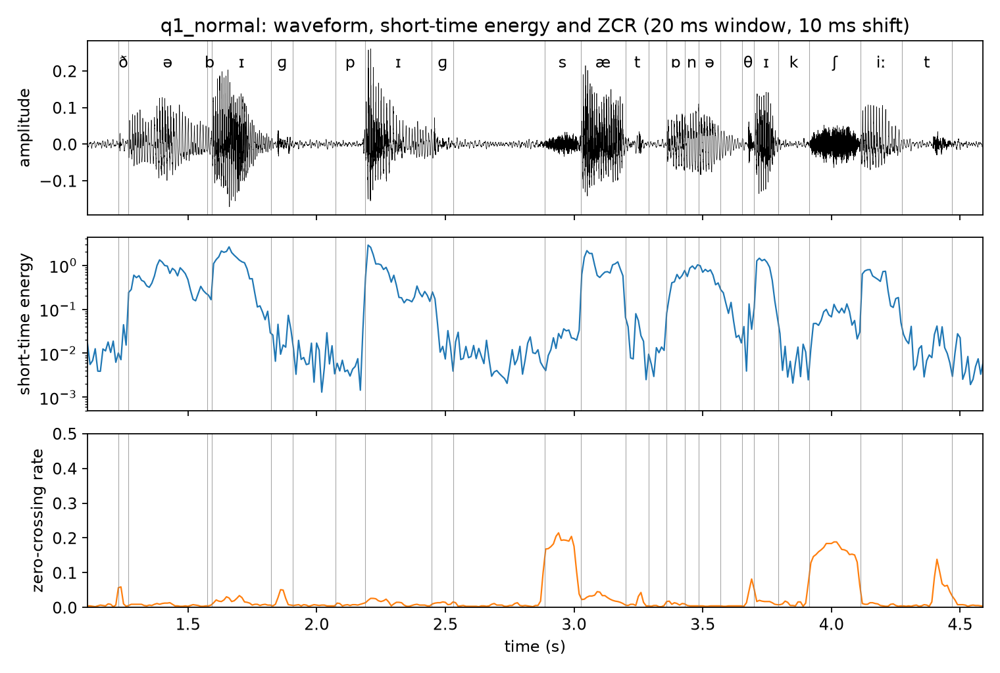
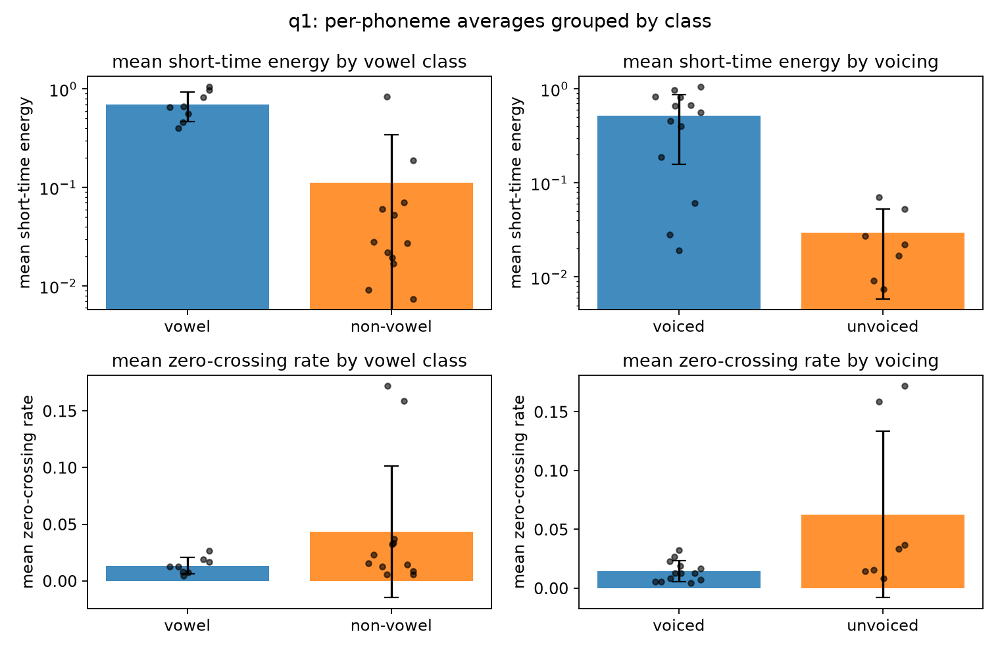
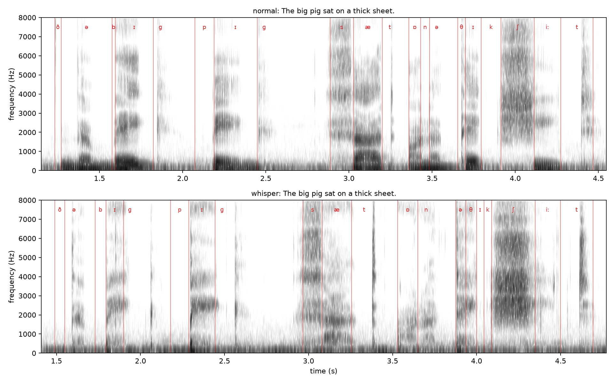
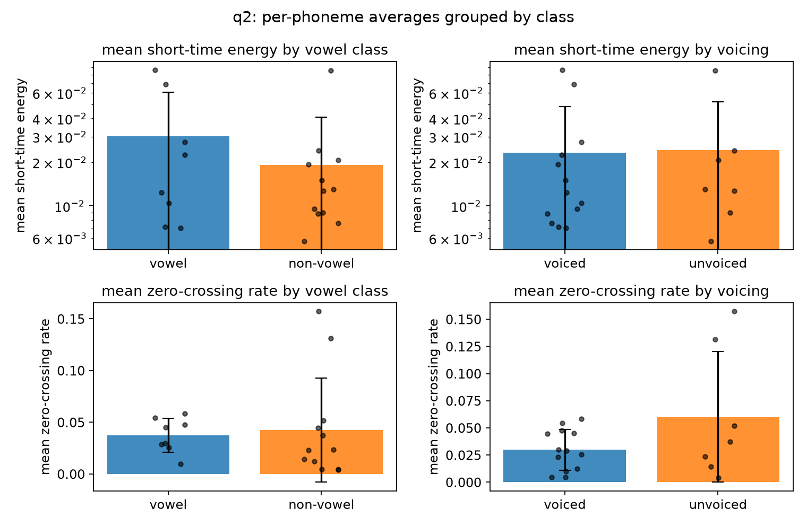
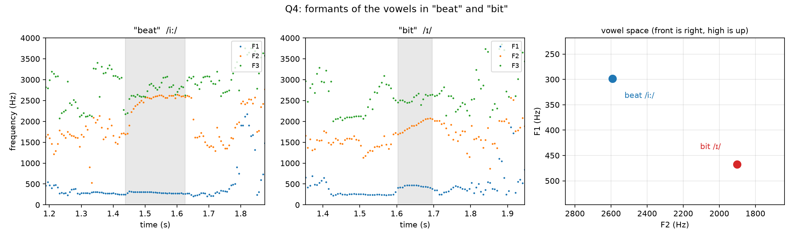
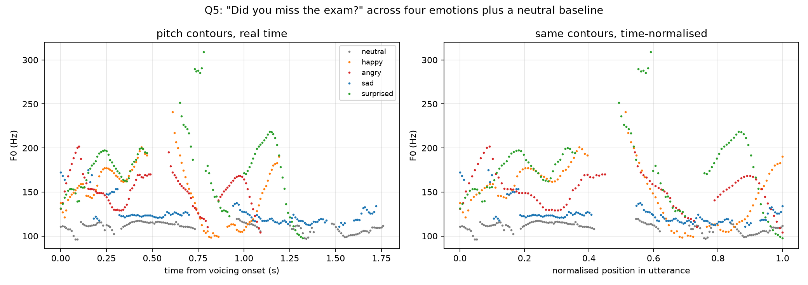
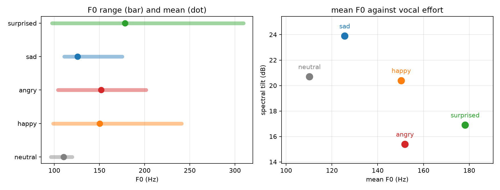
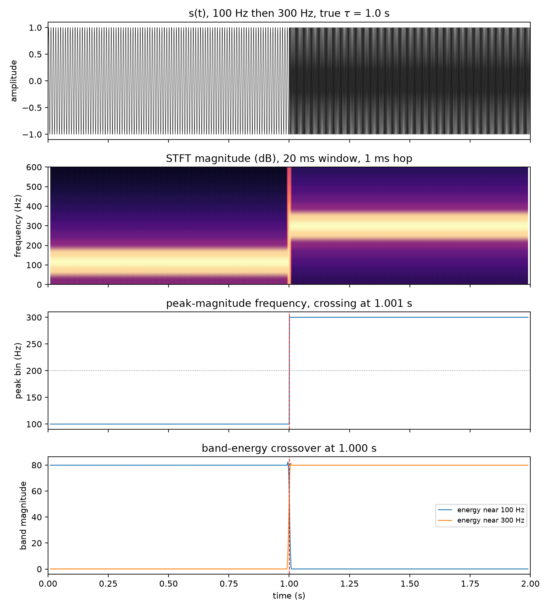
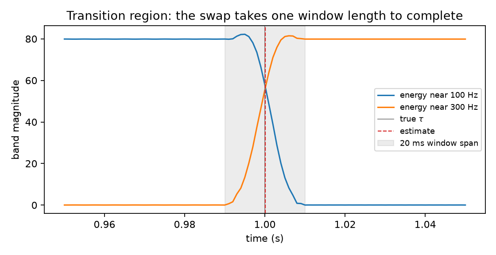
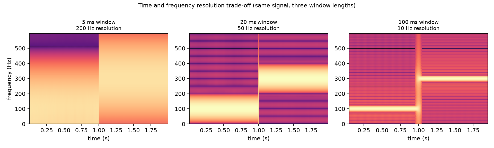

# Method

Recordings were made in Praat 7.0, mono at 44.1 kHz, at a fixed microphone distance across
all takes. Recording was done under a duvet to damp room reflections.

{width=55%}

Short-time energy and ZCR (Q1) were computed in NumPy with a 20 ms Hamming window and 10 ms
shift, which at 44.1 kHz is an 882-sample window advancing 441 samples. Pitch (Q5) and
formants (Q4) were extracted with Praat. Phoneme boundaries (Q1a, Q2) were marked by hand in
Praat from the waveform and a wideband spectrogram (5 ms window, 0–5 kHz) with glottal
pulses shown. Stops begin at the onset of closure and the following vowel at the first
glottal pulse, and fricatives at the onset of frication.

**Mains interference.** All the recordings contain a steady 100 Hz tone, the second harmonic
of the 50 Hz mains supply. It is present during the silences as well as during speech, and it
sits close to the speaker's own pitch, so Praat mistakes it for voicing. On the raw whispered
file Praat reports 18.8% voiced frames, but those frames are spread evenly across the whole
file instead of being concentrated in the speech, which is what identifies them as
interference rather than phonation.

A high-pass filter at 150 Hz removes the tone. Pitch tracking still works on the filtered
signal, because it measures how often the waveform repeats and the filter does not change
that. Pitch and formants were therefore measured on the filtered recordings, and energy and
ZCR on the originals, since filtering would change the quantity Q1 asks for.

Everything regenerates with `code/run_all.sh`.

# Question 1

## (a) Segmentation

The sentence recorded was "The big pig sat on a thick sheet.", transcribed as
ð ə **|** b ɪ ɡ **|** p ɪ ɡ **|** s æ t **|** ɒ n **|** ə **|** θ ɪ k **|** ʃ iː t, 20 phonemes. Boundaries were
marked in Praat on a wideband spectrogram as described in the Method. The delivery was
slow enough to leave audible pauses between some words; these are labelled as silence
rather than absorbed into the neighbouring stop closure, which would otherwise drag that
consonant's mean energy down. The TextGrid is `textgrids/q1_normal.TextGrid`.

## (b) Short-time energy and zero-crossing rate

Both were computed with a 20 ms Hamming window and a 10 ms shift, giving 552 frames for
the 5.53 s recording. Energy is the sum of squared windowed samples in each frame. ZCR is
the proportion of adjacent sample pairs that change sign, computed on the unwindowed frame.
Tapering the frame towards zero at its edges would introduce sign changes belonging to the
window rather than to the signal.

The two measures behave in opposite directions. Energy peaks on the vowels and drops by
about three orders of magnitude during stop closures, from a peak frame value of 2.87 to
1.4e-03 at the quietest point of a closure. ZCR is near zero through the voiced
portions and rises sharply at exactly four places, namely /s/ at 2.9 s, /θ/ at 3.7 s, /ʃ/ at
4.0 s and the final /t/ release at 4.4 s.

## (c) Averages within each phoneme

| phone | class | voicing | duration (ms) | mean energy | mean ZCR |
|---|---|---|---|---|---|
| ð | non-vowel | voiced | 39.9 | 1.93e-02 | 0.0323 |
| ə | vowel | voiced | 304.3 | 5.62e-01 | 0.0072 |
| b | non-vowel | voiced | 20.0 | 1.87e-01 | 0.0057 |
| ɪ | vowel | voiced | 229.5 | 1.05e+00 | 0.0165 |
| ɡ | non-vowel | voiced | 84.8 | 2.81e-02 | 0.0230 |
| p | non-vowel | unvoiced | 114.7 | 7.43e-03 | 0.0084 |
| ɪ | vowel | voiced | 259.4 | 6.59e-01 | 0.0127 |
| ɡ | non-vowel | voiced | 84.8 | 6.08e-02 | 0.0126 |
| s | non-vowel | unvoiced | 139.7 | 2.21e-02 | 0.1719 |
| æ | vowel | voiced | 174.6 | 9.77e-01 | 0.0264 |
| t | non-vowel | unvoiced | 89.8 | 2.73e-02 | 0.0143 |
| ɒ | vowel | voiced | 69.8 | 3.99e-01 | 0.0125 |
| n | non-vowel | voiced | 54.9 | 8.31e-01 | 0.0057 |
| ə | vowel | voiced | 84.8 | 6.67e-01 | 0.0043 |
| θ | non-vowel | unvoiced | 44.9 | 5.29e-02 | 0.0369 |
| ɪ | vowel | voiced | 94.8 | 8.18e-01 | 0.0190 |
| k | non-vowel | unvoiced | 119.7 | 9.16e-03 | 0.0153 |
| ʃ | non-vowel | unvoiced | 199.5 | 7.02e-02 | 0.1589 |
| iː | vowel | voiced | 159.6 | 4.58e-01 | 0.0080 |
| t | non-vowel | unvoiced | 194.6 | 1.68e-02 | 0.0336 |

The same values grouped by class.

| grouping | n | mean energy | mean ZCR |
|---|---|---|---|
| vowel | 8 | 6.98e-01 | 0.0133 |
| non-vowel | 12 | 1.11e-01 | 0.0432 |
| voiced | 13 | 5.16e-01 | 0.0143 |
| unvoiced | 7 | 2.94e-02 | 0.0627 |

**Vowels against non-vowels.** Vowels average 6.3 times the energy of non-vowels and about
one third of the ZCR. The energy difference follows from the source. Vowels are produced with an open vocal
tract and a vibrating larynx, so they carry almost all of the acoustic energy of the
utterance. The ZCR difference follows from where that energy sits
in frequency. A periodic signal whose energy is concentrated in low formants crosses zero
few times per frame, while the aperiodic high-frequency noise of a fricative crosses many
times.

**Voiced against unvoiced.** The separation is larger. Voiced segments average 17.6 times
the energy of unvoiced ones, and unvoiced segments have 4.4 times the ZCR. Voicing is the
better predictor of both measures than the vowel distinction, which makes sense because the
vowel class is a subset of the voiced class, and the voiced consonants /n/, /b/ and /ð/
carry the vowel-like pattern with them.

**Individual phonemes that do not follow the pattern.** /n/ has an energy of 8.31e-01,
higher than four of the eight vowels, and a ZCR of 0.0057, among the lowest of any segment.
It is a voiced non-vowel, so it raises the non-vowel average and lowers the non-vowel ZCR
average.
Grouping by voicing rather than by vowel class puts it on the correct side. /b/ likewise
has a relatively high energy of 1.87e-01 for a stop, because it is only 20 ms long and sits
between two vowels, so the frames covering it are dominated by the surrounding voicing.
Among the unvoiced segments, /p/ and /k/ have the lowest energies of all, 7.43e-03 and
9.16e-03, since both intervals are mostly closure silence.

The clearest single result is the ZCR of /s/ (0.1719) and /ʃ/ (0.1589). Even the lower of
the two is 4.9 times the highest ZCR of any voiced segment, and /s/ is 40 times the lowest.
/θ/ is the exception among the fricatives at 0.0369, well below the other two, because it is
much weaker and its frames are partly filled by the low-level background rather than by
frication.

# Question 2

The same sentence was recorded whispered and segmented the same way
(`textgrids/q2_whisper.TextGrid`). The two recordings are compared below.

| measure | normal | whisper |
|---|---|---|
| speech duration | 3.238 s | 3.203 s |
| voiced frames | 132 / 549 (24.0%) | 2 / 580 (0.3%) |
| mean F0 | 101.9 Hz | not measurable |
| RMS | −33.4 dB | −45.0 dB |
| spectral centroid | 633 Hz | 829 Hz |
| energy below 1 kHz vs above | +9.5 dB | −5.0 dB |
| vowel / non-vowel energy ratio | 6.3 | 1.6 |
| voiced / unvoiced energy ratio | 17.6 | 1.0 |

## (a) What is unchanged, and is the message preserved?

The message is preserved. The whispered recording is intelligible and every phoneme in the
sentence can still be located and labelled, which is why the same 20-phoneme segmentation
applies to both files.

What survives is everything produced above the larynx. The vocal tract still takes the same
sequence of shapes, so place and manner of articulation are unchanged and the formant
pattern remains. The spectrograms show the same formant bands in both recordings, produced
by noise in the whisper instead of by glottal pulses. Total speech duration is almost identical,
3.238 s against 3.203 s, so the timing of the utterance is preserved as well. Fricatives are
the least affected of all, since /s/, /ʃ/ and /θ/ were already produced with turbulent noise
and no voicing.

## (b) What does whisper gain to become normal speech, and is speaker identity preserved?

The addition is phonation. Voicing takes the whisper's aperiodic noise source and replaces it
with a periodic one. That brings a fundamental frequency and a harmonic spectrum, and with
them intonation, stress, and the pitch contour that separates a statement from a question. Measured here, that
is the difference between 24.0% voiced frames at a mean F0 of 101.9 Hz and 0.3% voiced
frames with no measurable F0.

The energy consequences are large. The whisper is 11.6 dB quieter overall, and its spectral
balance is shifted 14.5 dB towards high frequencies. Within the whisper the voiced/unvoiced
energy ratio collapses from 17.6 to 1.0, meaning the phonemes that were separated by 12.4 dB
of energy in normal speech are indistinguishable on that measure once phonation is removed.

The zero-crossing rate survives better than energy. Unvoiced segments still have twice the
ZCR of voiced ones in the whisper, against 4.4 times in normal speech, because ZCR depends on
where the energy sits in frequency rather than on whether the source is periodic.

Speaker identity is only partly preserved. The vocal tract is unchanged, so the cues that
depend on its size and shape survive, meaning formant frequencies and formant spacing,
together with learned habits of timing and articulation. What is lost is everything
carried by the glottal source, which includes mean pitch, pitch range, and the detail of the
voice quality such as breathiness and creak. This is why whispered speech is recognisable as
a person but much harder to identify confidently, and why speaker verification systems
degrade sharply on whispered input.

## (c) The state of the vocal folds

In whispering the vocal folds are brought close together (adducted) but not close enough, and
not under the right tension, to be set into self-sustaining vibration. Typically the front
part of the glottis is closed while a triangular opening remains at the back, at the
cartilaginous portion, called the glottal chink. Air forced through this narrow opening
becomes turbulent, and that turbulence is the sound source. It is aperiodic, which is why
the whisper has no F0 to measure.

The vocal folds take several other states.

- **Open (abduction)**, as in quiet breathing and in voiceless sounds such as /s/ and /p/,
  where the folds are apart and air passes without obstruction.
- **Modal voice**, the normal speaking state, where the folds are adducted and vibrate
  periodically. This produced the 101.9 Hz measured in the normal recording.
- **Breathy voice**, where the folds vibrate but remain slightly apart, so periodic voicing
  and turbulent noise are present together.
- **Creaky voice** (vocal fry), with the folds tightly adducted and slack, giving very low
  and irregular pulses.
- **Full closure**, as in the glottal stop, where the folds are pressed together and airflow
  stops completely.

## (d) Can every English word be distinguished in a whisper? "pig" against "big"

Not equally well. Any contrast that depends on voicing loses its primary cue, because
voicing is precisely what whispering removes. English has many such minimal pairs,
among them pig/big, tie/die, coat/goat, fan/van, sue/zoo, and word-finally tap/tab and
seat/seed.

For "pig" against "big" the primary distinction is the presence of vocal fold vibration
during and immediately after the closure. In the whisper that cue is gone from both, so a
listener has to rely on secondary cues, which survive but are weaker.

- **Voice onset time.** In the recordings here, the release-to-vowel interval is 16 ms for
  /b/ against 20 ms for /p/ in normal speech, but 8 ms against 92 ms in the whisper. The
  difference is larger in the whisper, not smaller, which suggests the aspiration of /p/ is
  exaggerated when voicing is unavailable to carry the contrast.
- **Burst strength.** The release of a voiceless stop is typically more forceful.
- **Preceding vowel duration**, which is the main cue for final voicing contrasts such as
  tap/tab, and is unaffected by whispering.

So the contrast degrades rather than disappearing outright. This is consistent with the
spectrograms, where the two segments look alike in the low frequencies, which is where
voicing would show, and differ in the timing and intensity of the release.

## (e) How can a mimic imitate another speaker's voice?

A voice is a mixture of properties that can be learned and properties fixed by anatomy, and
a mimic can only copy the first group.

The learnable layer is large. It includes mean pitch and pitch range, intonation patterns,
speech rate and rhythm, voice quality such as breathiness or creak, and the habits of
pronunciation and word choice that make a person recognisable. Trained imitators also adjust vocal tract shape deliberately, for
example by rounding the lips or lowering the larynx, which shifts the formants towards the
target speaker's.

What cannot be changed is the physical apparatus, meaning vocal tract length, the resonant
cavities of the nose and sinuses, and the size and mass of the vocal folds. These set the
formant frequencies and the fine detail of the glottal source. A good impression therefore
works by reproducing the salient, learnable cues that listeners actually attend to, mainly
prosody and a few distinctive articulations, while the underlying acoustics remain those of
the imitator. This is why impressions convince human listeners far more easily than they
fool a speaker verification system, which measures exactly the spectral detail the mimic
cannot alter.

# Question 3

**(a) "reusable" = "re-" + "use" + "-able".** This is **morphology**, which deals with the
internal structure of words and how their parts combine. Two derivational affixes attach to a free root, and the order is
[[re + use] + able].

**(b) "bank" as riverside or financial institution.** This is **semantics**, which deals with
the relation between a form and its meanings. This is homonymy rather than polysemy, as the river sense comes through
Old Norse and the financial sense through Italian *banca*, so they are two distinct lexical
items sharing a form.

**(c) "The teacher explained the lesson to the students" is SVO.** This is **syntax**, which
deals with the arrangement of constituents and the word order English uses. It does not depend on what the words mean.

**(d) "fan" and "van" differ by one phoneme.** This is **phonology**. The minimal-pair test
establishes that /f/ and /v/ are contrastive phonemes of English. Phonetics would describe how they
differ physically (both labiodental fricatives, /v/ voiced); phonology concerns the fact
that the difference distinguishes words. The same phonetic difference is not contrastive in
every language.

**(e) "It's getting dark in here" as a request.** This is **pragmatics**. The literal content
is a statement, while the intended force is a request. This is an indirect speech act, resolved by
reasoning about context. Nothing in the words encodes a request.

**(f) [t] in "talk" made with the tongue behind the upper front teeth.** This is
**phonetics**, specifically articulatory phonetics, since the statement describes where an
articulator is placed rather than any contrastive function.

The description is not accurate for standard English. /t/ in "talk" is *alveolar*, made with
the tongue tip at the alveolar ridge behind the teeth, not against the teeth themselves. A
dental [t̪] does occur in English before a dental fricative, as in "eighth", and is
characteristic of several varieties including many Indian English accents, but not in
"talk".

# Question 4

"beat" and "bit" were recorded in isolation at matched loudness and pitch. Formants were
extracted with Praat's Burg method (5 poles, 5500 Hz maximum, 25 ms window). The vowel was
taken as the longest run within 10 dB of peak energy in a 300–3500 Hz band, and values are
averaged over the middle third of that region.

| | vowel | duration (ms) | F1 (Hz) | F2 (Hz) | F3 (Hz) | F2 − F1 (Hz) |
|---|---|---|---|---|---|---|
| beat | /iː/ | 187.5 | 298 | 2591 | 2833 | 2293 |
| bit | /ɪ/ | 93.7 | 467 | 1901 | 2564 | 1434 |

The two vowels differ in four ways.

- **F1 is 169 Hz higher in "bit".** F1 varies inversely with tongue height, so /ɪ/ has a
  lower tongue body. /iː/ is close, /ɪ/ near-close.
- **F2 is 690 Hz lower in "bit".** F2 rises as the tongue moves forward, so /iː/ is fully
  front and /ɪ/ is retracted towards the centre.
- **F2 − F1** is 2293 Hz for /iː/ and 1434 Hz for /ɪ/. This combines both effects and gives
  a larger difference than either formant on its own.
- **F3 is similar** (2833 vs 2564 Hz), as expected since F3 depends less on height and
  frontness. In "beat" F2 and F3 converge to within 240 Hz, characteristic of a close front
  vowel.
- **The vowel in "beat" is twice as long.** /iː/ is tense and /ɪ/ lax. The ratio is larger
  than the usual 1.5:1 because these are isolated words with no following material.

F2 in "beat" rises through the vowel rather than holding flat, which is the offglide of the
diphthongised English /iː/.

The result depends on the maximum-formant setting. At 5000 Hz the tracker gave F2 = 1716 Hz
for "beat", lower than for "bit" and contradicting the spectrogram, where the second formant
is clearly near 2600 Hz. At 5500 Hz it follows the visible bands correctly for both words.

# Question 5

"Did you miss the exam?" was recorded neutrally as a baseline and in four emotions. Pitch was
extracted in Praat with `To Pitch` at a 10 ms step, floor 70 Hz, ceiling 500 Hz. Frames
outside the speech region and voiced runs shorter than three frames were discarded.

Pitch alone turned out not to describe these recordings well, so two further measures are
included. RMS is the loudness over the speech region. Tilt is the energy from 150 to 1000 Hz
relative to 1 to 5 kHz, which rises when the speaker uses less vocal effort, because a
quieter voice loses proportionally more high-frequency energy. Tilt matters because loudness
on its own cannot distinguish a quieter voice from a microphone that was further away, while
distance leaves tilt roughly unchanged.

| emotion | dur (s) | mean F0 | min | max | range (Hz) | range (st) | SD | RMS (dB) | tilt (dB) |
|---|---|---|---|---|---|---|---|---|---|
| neutral | 1.76 | 110.2 | 96.2 | 119.7 | 23.5 | 3.78 | 5.4 | −30.8 | 20.7 |
| happy | 1.19 | 150.3 | 98.6 | 241.0 | 142.4 | 15.48 | 31.7 | −25.5 | 20.4 |
| angry | 1.09 | 151.9 | 104.2 | 201.6 | 97.5 | 11.43 | 20.5 | −22.0 | 15.4 |
| sad | 1.72 | 125.6 | 111.0 | 175.1 | 64.1 | 7.90 | 12.8 | −34.7 | 23.9 |
| surprised | 1.32 | 178.2 | 97.6 | 309.3 | 211.7 | 19.96 | 42.3 | −25.5 | 16.9 |

**Happy** has a mean F0 of 150.3 Hz, 5.4 semitones above neutral, with the range widening
from 23.5 Hz to 142.4 Hz and the SD from 5.4 Hz to 31.7 Hz. It is 5.3 dB louder than neutral.
The contour moves continuously instead of holding near a level.

**Angry** sits at almost the same mean F0 as happy, 151.9 Hz against 150.3 Hz, a difference
of 0.2 semitones. Its range is narrower, 97.5 Hz against 142.4 Hz. What separates it most
clearly from happy is effort rather than pitch. Angry is the loudest recording at 8.8 dB
above neutral, and its tilt of 15.4 dB is 5 dB flatter than happy's 20.4 dB, meaning
considerably more high-frequency energy and a harder voice quality. It is also the shortest
take at 1.09 s.

**Sad** is the clearest case of pitch measures pointing the wrong way. Its mean F0 of
125.6 Hz is 2.3 semitones *above* neutral, and its range of 7.90 semitones is wider than
neutral's 3.78, whereas sadness is usually described as lowering mean F0 and narrowing the
range. The other two measures behave as expected. It is the quietest recording at 3.9 dB
below neutral, and its tilt of 23.9 dB is the steepest of the five, 3.2 dB above neutral,
which indicates reduced vocal effort rather than a change in microphone distance. At 1.72 s
it is also the slowest of the four emotional takes, matching the neutral baseline's 1.76 s
while every other emotion is at least 0.4 s shorter.

The sad delivery is therefore carried by rate and vocal effort, while F0 works against it. A
description based on pitch alone would misrepresent this recording.

**Surprised** has the highest mean F0 at 178.2 Hz, 8.3 semitones above neutral. It also has
the widest range at 211.7 Hz, the highest single value at 309.3 Hz and the largest SD at
42.3 Hz. The contour reaches its maximum about 20% of the way through the utterance and falls
after that.

## What the measures do and do not separate

Mean F0 sorts the five recordings roughly by how activated the delivery is, with happy,
angry and surprised 5.4 to 8.3 semitones above neutral. It fails in two places. It cannot
tell happy from angry, which are 0.2 semitones apart, and it puts sad on the wrong side of
neutral entirely.

Adding the other two measures resolves both. Tilt separates happy from angry by 5 dB, and
loudness and tilt together identify sad as the quietest and least effortful of the five even
though its pitch is raised. Each of the four emotions is uniquely identified by the
combination, while no single measure achieves this on its own.

All five recordings end with a rise on "exam". The rise is present in the neutral baseline as
well, so it belongs to the interrogative sentence type rather than to any of the emotions.

# Question 6

$s(t) = \sin(2\pi f_1 t)$ for $0 \le t \le \tau$, $\sin(2\pi f_2 t)$ for $\tau < t \le 2$,
and 0 otherwise, with $f_1 = 100$ Hz, $f_2 = 300$ Hz and $\tau = 1$ s. The signal was
synthesised at 8 kHz. Both estimates below use only the STFT magnitudes.

**Settings.** The window is fixed at 20 ms by the question, which is 160 samples at 8 kHz,
Hamming. The hop was set to 1 ms rather than 10 ms, because the hop determines how finely
the transition can be located, and a 10 ms hop would restrict the answer to a 10 ms grid. The
FFT bin spacing is $8000/160 = 50$ Hz.

**Estimate 1, peak-frequency track.** Take the largest-magnitude bin in each frame and find
the first frame where it exceeds 200 Hz, the midpoint of the two tones. This gives
$\hat{\tau} = 1.0010$ s, an error of +1.0 ms.

**Estimate 2, band-energy crossover.** Sum the magnitude in a 50 Hz band around each tone and
find where the 300 Hz curve overtakes the 100 Hz curve, interpolating between the straddling
frames. This gives $\hat{\tau} = 1.0001$ s, an error of +0.1 ms. It is more accurate than the
first estimate for two reasons. Interpolating between frames removes the 1 ms quantisation,
and summing over a band is less sensitive to which individual bin happens to be largest in a
given frame.

**Precision.** The 0.1 ms figure is more precise than the measurement warrants. Any frame
whose 20 ms span straddles $t = \tau$ contains both tones, so the transition cannot be localised more finely
than the window. Measuring the region where both bands carry significant energy gives 12 ms
rather than the full 20 ms, because the Hamming taper suppresses a tone entering at the edge
of a frame. The result is $\tau = 1.00 \pm 0.01$ s. The window length sets this uncertainty. Shortening
the hop does not reduce it.

**Resolution trade-off.** A 20 ms window holds exactly 2 cycles of a 100 Hz tone, which is
too few to estimate a frequency sharply. In the spectrogram the 100 Hz component appears as
a smear from roughly 0 to 200 Hz, while the 300 Hz component, with 6 cycles, is better
resolved. A longer window would separate the tones more sharply but smear the transition over
a longer span; a shorter window would locate $\tau$ more tightly but leave the tones barely
distinguishable. For this signal the 20 ms window is a workable compromise, since the tones
are 200 Hz apart, four times the bin spacing.

# Question 7

The application chosen is **speech emotion recognition**.

**(a) The application.** Speech emotion recognition (SER) infers a speaker's affective state
from the speech signal. It is framed either as discrete labels such as anger, happiness,
sadness and neutral, or as continuous dimensions, usually arousal and valence. The
dimensional form is often preferred because discrete labels transfer poorly across languages
and cultures.

Deployed uses include call-centre analytics, where rising frustration flags a call for
escalation, clinical screening, where flattened prosody is studied as a marker of depression,
driver monitoring, and conversational agents that adapt when a user is upset. In these
systems the words are already available from speech recognition, and SER is added to recover
information that the transcript does not carry.

**(b) Features used.** Four groups of features are normally combined.

- Prosodic features are mean F0, F0 range and variability, contour shape and slope,
  intensity, speech rate and pause structure. These carry arousal well, and the Q5
  measurements are exactly this kind of input.

- Spectral features are MFCCs with their derivatives, formants, spectral centroid and
  spectral tilt. Tilt is useful because it tracks vocal effort somewhat independently of
  pitch.

- Voice quality features are jitter, shimmer and the harmonics-to-noise ratio. These describe
  how the vocal folds vibrate rather than how fast, and they separate states that prosody
  confuses, such as sadness and tenderness at a similar F0.

- Learned features replace hand-measured quantities altogether. Recent systems let a neural
  network learn its own representation from large amounts of unlabelled speech, using models
  such as wav2vec 2.0 or HuBERT. These perform better on most benchmarks but are harder to
  interpret when they fail.

No single measure is enough on its own. The Q5 recordings show this directly, where mean F0
puts happy and angry 0.2 semitones apart while spectral tilt separates them by 5 dB.

The two dimensions are also not equally easy to recover. Arousal is predicted well from
prosody and energy together. Valence is predicted poorly from acoustics, since high-arousal
positive and negative states look similar in F0 and intensity. This is why systems that
combine audio with the recognised text gain substantially on valence and little on arousal.

**(c) Contributions from the levels of description.**

- Phonetics contributes voice quality and articulation. High arousal expands the vowel space,
  while sadness produces reduced, centralised articulation.

- Phonology matters because what carries emotion is not raw F0 but the intonational contours
  it realises, including pitch accents and boundary tones. These are language-specific.

- Morphology contributes in languages with productive evaluative affixes, such as Spanish
  *-ito*. English has little of this, so the contribution here is small.

- Syntax interacts with prosody in ways that can mislead a system. The Q5 sentence shows the
  risk, since "Did you miss the exam?" carries a terminal rise in all five recordings simply
  because it is an interrogative. A system treating a terminal rise as evidence of surprise
  would misread every one of them.

- Semantics contributes lexical valence, which is the main route by which valence becomes
  recoverable at all.

- Pragmatics is needed for sarcasm, which is defined by a mismatch between literal content and
  intended meaning, so detecting it requires both channels plus context. Cultural display
  rules also govern how much emotion is expressed in the first place.

**(d) A limitation.** Systems generalise poorly beyond their training corpus, and the cause is
the data. Emotion cannot be induced on demand reliably or ethically, and there is no ground
truth beyond annotator agreement, so most corpora use acted speech, with actors reading fixed
sentences in a target emotion.

Acted emotion is exaggerated and prototypical. This makes it easy to classify, but it differs
from spontaneous speech, in which emotions are subtler, often blended, and frequently
suppressed. Accuracy drops substantially when models are tested cross-corpus. Speaker,
language and cultural variation is also large relative to the emotion effect, and
inter-annotator agreement is only moderate, which caps the accuracy any system can
meaningfully claim.

The Q5 recordings show the same problem on a small scale. They were produced deliberately with
the target emotion known in advance, and are almost certainly more distinct from one another
than the same question asked in each of those states would be. The sad recording is the
clearest warning against reading too much into any one feature, since its mean F0 moved
2.3 semitones in the opposite direction to the textbook description while loudness and vocal
effort moved as expected. A model trained on a corpus where sadness always lowers F0 would
classify that recording wrongly.
